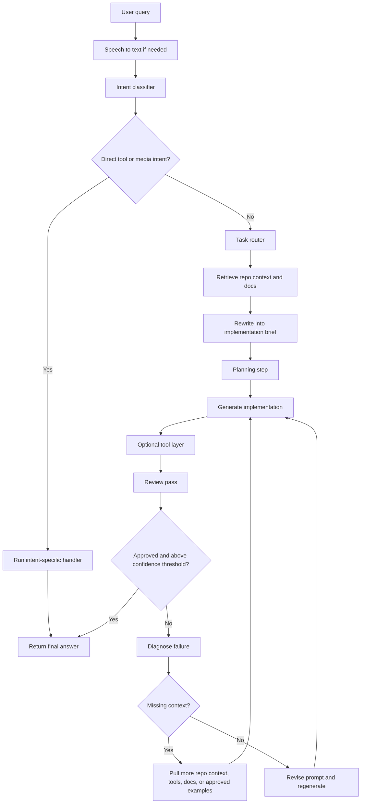

# AI Workflow

> Last Updated: March 17, 2026

> **In plain terms:** This doc explains how Loco should think through an AI request before answering it.

## Purpose

This document explains, in simple terms, how Loco should handle requests before answering the user.

The idea is straightforward:
Loco should not guess, rush, or answer in one big step.
It should understand the request, gather the right context, make a small plan, generate an answer, and then check the answer before returning it.

## Core Idea

Better answers usually come from a better process.

That process is:
- understand what the user wants
- gather the right files, errors, or examples
- choose the right model or tool
- make a short plan
- generate the answer
- review the answer
- fix it if needed

In plain English:
do not rely on a first draft if the task is important.

## Baseline Standards

Use [LOCO_CODING_KNOWLEDGE_BASE.md](c:\Projects\loco\my-app\Documentation\LOCO_CODING_KNOWLEDGE_BASE.md) as the main standard for:

- code quality
- frontend rules
- backend rules
- debugging steps
- review expectations

Other instruction files can add more detail, but they should not fight with that baseline.

## Recommended Flow

```text
User asks something
-> convert speech to text if needed
-> figure out what kind of request it is
-> check whether it is a direct tool or media request
-> choose the right model or handler
-> gather useful context
-> rewrite the request into a clear internal brief
-> make a short plan
-> generate an answer
-> use tools if needed
-> review the answer
-> if the answer is weak, figure out why
-> get more context or revise the prompt
-> generate again
-> return the final answer
```

## Where The LLMs Appear In This Flow

Here is the same flow, but with the LLM-related parts called out clearly.

```text
User asks something
-> convert speech to text if needed
   what it does: turns voice into text
   LLM role: usually none, or a speech model instead of a normal text LLM

-> figure out what kind of request it is
   what it does: decides whether the user wants code, an explanation, debugging, review, media playback, and so on
   LLM role: often a small classifier model or lightweight LLM step

-> check whether it is a direct tool or media request
   what it does: decides whether the request should skip the normal coding flow
   LLM role: sometimes a small intent model, sometimes simple rules

-> choose the right model or handler
   what it does: picks which LLM or non-LLM handler should do the work
   LLM role: no main answer is written here; this is the routing step

-> gather useful context
   what it does: collects repo files, errors, docs, examples, memory, and attachments
   LLM role: optional; an LLM can help choose what to retrieve, but it does not produce the final answer yet

-> rewrite the request into a clear internal brief
   what it does: turns the raw user message into a cleaner task description
   LLM role: yes, this is often an LLM step

-> make a short plan
   what it does: breaks the task into a few concrete steps
   LLM role: yes, this is usually an LLM planning step

-> generate an answer
   what it does: writes the code, explanation, fix, or implementation
   LLM role: yes, this is the main generation model

-> use tools if needed
   what it does: reads files, runs tests, checks docs, or performs actions
   LLM role: the LLM may decide which tool to use, but the tools do the actual execution

-> review the answer
   what it does: checks whether the draft is correct, complete, and likely to work
   LLM role: yes, this is usually a separate reviewer LLM step

-> if the answer is weak, figure out why
   what it does: identifies the failure reason, such as missing context or a logic mistake
   LLM role: yes, often handled by the reviewer or diagnosis step

-> get more context or revise the prompt
   what it does: fixes the reason the first draft failed
   LLM role: partial; retrieval may be tool-driven, while prompt revision is often LLM-assisted

-> generate again
   what it does: produces a better second draft
   LLM role: yes, this is another generation step

-> return the final answer
   what it does: sends the approved result back to the user
   LLM role: no major new reasoning here unless a final cleanup or formatting pass is used
```

## Simple LLM Map

In plain terms, the LLMs mainly appear in these parts:

- classification: understanding what kind of task the user is asking for
- rewriting: turning the request into a clean internal brief
- planning: making a short step-by-step approach
- generation: producing the main answer
- review: checking whether the answer is good enough
- diagnosis and retry: figuring out why a draft failed and helping improve the next one

The parts that are often not a normal LLM step are:

- speech to text
- direct tool execution
- media playback handlers
- file reads, test runs, and API calls done by tools

So the simplest way to explain it is:
the LLMs do the thinking, writing, planning, and reviewing, while the tools do the actual actions.

## Flowchart



## Direct Media Intents

Some requests should skip the full coding workflow.

Examples:
- play a YouTube video
- play the latest video from an artist or topic
- open a saved playlist shortcut
- answer a YouTube setup question

Example user requests:
- Play After Hours on YouTube
- Loco, play my boss playlist
- Show me videos about Next.js routing on YouTube
- Find the latest Bad Bunny video on YouTube

In simple terms, Loco should:
- detect these requests early
- use the YouTube-specific path instead of a long AI explanation
- only ask follow-up questions if the request is too vague
- keep the answer short and action-focused
- normalize spelling mistakes like `you tube`, `yt`, or `youtbe`
- treat personal library requests such as watch later or liked videos as an authenticated path, not a public search

## Model Router

Loco should not pick models randomly.

It should use a simple routing rule based on the task type.

Example:

```text
coding work -> Claude
data or architecture reasoning -> ChatGPT-style routing
voice-first conversation or explanation -> Gemini-style routing
```

Current idea:
- code-heavy work should prefer Claude
- data-shaped tasks should prefer ChatGPT-style routing
- explanation-first conversation should prefer Gemini-style routing
- direct YouTube playback should skip the model router and go straight to the media handler
- if a preferred provider is unavailable, Loco should fall back cleanly and record that fallback

## Tool Layer

Loco should do more than just talk.

Eventually it should be able to use tools such as:
- runCode
- createGraph
- searchDocs
- openFile
- readRepoFile
- runTests

Right now, Loco already has some internal flows, such as:
- calendar actions
- memory retrieval
- attachment context
- preview feedback

But it does not yet have a full coding-agent execution layer inside the chat route.

So for now, the tool layer mostly means:
- know which tools are available
- record that in workflow metadata
- use tool awareness during generation and review

## Planning Stage

Loco should not jump straight into code.

Before generating, it should make a short plan.

Example:

```text
Plan:
1. Create API route
2. Validate input
3. Delete the database record
4. Return a success response
```

This helps reduce sloppy first drafts and keeps the answer more organized.

## Project Memory

One of Loco's strengths is that it should remember useful context over time.

Examples of useful memory:
- repo structure
- framework and stack
- previous fixes
- user preferences
- common project patterns

This helps Loco feel more useful and less stateless.

Current implementation already includes:
- assistant memory
- prior conversation retrieval
- attachment context
- runtime preview feedback

The next step is to make project memory easier to retrieve during routing and planning.

## Confidence Gating

The review step should not just say yes or no.
It should also estimate how confident Loco is that the answer is correct.

Example:

```yaml
approved: true
matchesUserRequest: true
worksLikely: true
confidenceScore: 0.82
missingContext: false
notes: follows repo patterns
```

In simple terms:
- if confidence is high enough, return the answer
- if confidence is too low, revise or ask for more context
- do not pretend a weak answer is ready

## Detailed Pipeline

### 1. User Query

The user asks for something.

Examples:
- Build a landing page
- Add an API route
- Fix a runtime error
- Refactor a component
- Explain how a file works

### 2. Classify The Request

First, figure out what kind of task this is.

Possible categories:
- coding
- explanation
- bug-fix
- frontend-build
- backend-api
- database-schema
- refactor
- review
- media-control

Plain-English goal:
- understand what the user is really asking for
- figure out whether this is code, explanation, debugging, or media control

### 3. Gather Relevant Context

Before generating an answer, collect the useful information.

Good sources, in order:
1. user-attached files or code
2. relevant repo files and project patterns
3. approved internal examples
4. runtime errors, lint output, or test failures
5. saved local app state such as playlist aliases or integration status
6. official docs
7. broader web sources only if necessary

This matters because bad answers often come from missing context, not from the model being bad.

### 4. Rewrite The Request Internally

Turn the raw user message into a clearer internal brief.

The brief should say:
- what the user wants
- what stack is being used
- which files matter
- what constraints matter
- what success looks like

Example:

```text
User goal: add a route to delete a chat session.
Stack: Next.js App Router, TypeScript, Prisma.
Relevant files: app/api/chat-sessions/[id]/route.ts, lib/prisma.ts.
Constraints: keep the existing API style.
Acceptance criteria: delete one session by id and return a clear success response.
```

### 5. Route To The Right Model

After classification, choose the best model family for the job.

Questions to answer:
- is this mostly coding?
- is this mostly data reasoning?
- is this more of a conversation request?
- what should the fallback be if the first provider is unavailable?

### 6. Generate The Answer

Now generate the answer using:
- the rewritten brief
- the gathered context
- the short plan

The output should be usable, not vague.

### 7. Review The Draft

After generation, review the answer.

The review should check:
- did it answer the actual user request?
- is it likely to work?
- does it fit the stack and project style?
- did it invent fake files, APIs, or dependencies?
- is anything important missing?

### 8. If The Review Fails, Find Out Why

Do not blindly try again.

Figure out the real problem:
- missing context
- missing docs
- logic bug
- wrong stack assumptions
- incomplete answer
- hallucinated dependency or file

### 9. Get More Context Or Revise

If the draft failed because context was missing, get more context.

If the draft failed because the reasoning was weak, revise the prompt and generate again.

### 10. Optional Second Review

For important tasks, run another review after revision.

Especially for:
- backend routes
- auth flows
- database changes
- stateful frontend logic
- code likely to be copied directly into the repo

### 11. Return The Final Answer

Only return the answer when it is approved or at least likely to work.

## Role Separation

Each stage should have one clear job.

Recommended roles:
- classifier: decide what kind of request this is
- model router: choose the best model family
- retriever: gather useful files, examples, and docs
- planner: create a short implementation plan
- tool layer: decide whether tools are needed
- generator: produce the answer
- reviewer: check correctness and fit

This makes the system easier to debug when something goes wrong.

## Short Version

```text
user asks for something
-> classify the task
-> choose the right model or tool path
-> gather useful context
-> rewrite the task into a clear brief
-> make a short plan
-> generate an answer
-> review it
-> if weak, fix the reason and try again
-> if solid, return it
```

## What Not To Do

- Do not skip context gathering for important tasks.
- Do not trust a first draft just because it sounds confident.
- Do not dump unrelated code into the prompt.
- Do not reuse old code blindly.
- Do not return important code without checking it.

## Recommendation For Loco

The most helpful improvements for Loco are:
1. Gather relevant repo files and examples before generating code.
2. Classify request types so frontend and backend tasks get the right handling.
3. Use a stronger review step that checks correctness, completeness, and stack fit.
4. Feed runtime errors, lint output, and tool output back into the retry loop.

In simple terms:
Loco should work like a careful developer, not like a fast guesser.