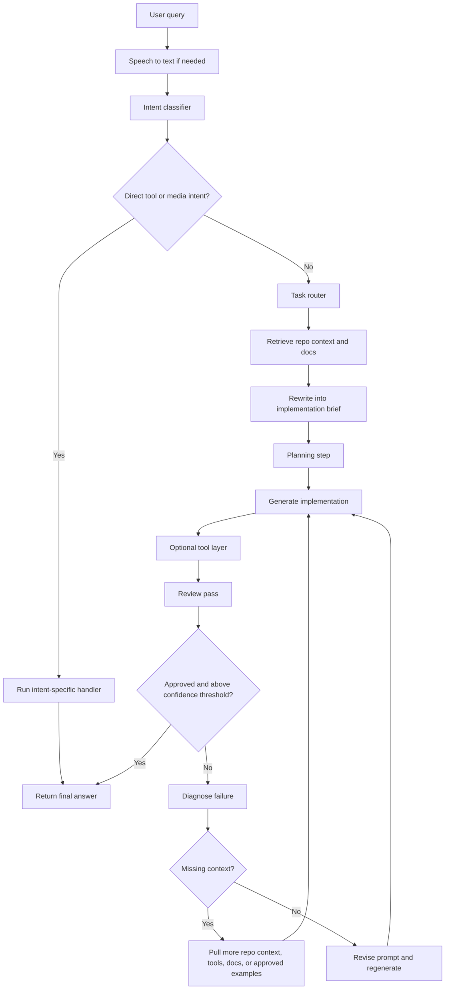

# AI Workflow

> Last Updated: March 15, 2026 at 06:02 PM EDT

## Purpose

This document defines a practical AI request pipeline for Loco so code-oriented requests are routed, enriched, planned, reviewed, and revised before the final response reaches the user.

The goal is to improve answer quality for frontend and backend work by making context gathering and validation explicit.

## Core Principle

Better code comes from better routing, better context, narrower task framing, explicit planning, tool awareness, and stronger verification.

Do not rely on a single model pass.
Use separate steps for classification, retrieval, generation, and review.

## Baseline Standards

Use [LOCO_CODING_KNOWLEDGE_BASE.md](c:\Projects\loco\my-app\Documentation\LOCO_CODING_KNOWLEDGE_BASE.md) as the baseline engineering standard for:

- code quality
- frontend conventions
- backend conventions
- debugging workflow
- review expectations

Specialized instruction files should refine that baseline rather than conflict with it.

## Recommended Flow

```text
User query
-> speech to text, if needed
-> classify request
-> detect direct tool or media intent
-> model router
-> retrieve relevant context
-> rewrite into implementation brief
-> planning step
-> generate answer with the routed model
-> optional tool layer
-> review answer
-> if review fails, determine why
-> retrieve missing context or revise prompt
-> regenerate answer
-> optional second review
-> response to user
```

## Flowchart



## Direct Media Intents

Not every user request should go through the full coding pipeline.

Loco should detect and fast-path direct media intents such as:

- play a YouTube video
- play the latest video from a topic or artist
- open a saved YouTube playlist alias
- answer setup questions about YouTube playback support

Examples:
- Play After Hours on YouTube
- Loco, play my boss playlist
- Show me videos about Next.js routing on YouTube
- Find the latest Bad Bunny video on YouTube

Recommended handling:
- classify these as media-control or direct-intent requests before normal model routing
- prefer the dedicated YouTube handler over a long-form model reply
- only ask a follow-up when the media target is too vague to search safely
- keep the returned response short and action-oriented
- resolve public YouTube playback through deterministic server-side filters and ranking before spending model tokens
- support structured hints such as artist, author or channel, live or upcoming, time or date windows, and location phrases when they appear in the request
- normalize common YouTube spelling variants such as `you tube`, `youtbe`, `yutube`, and `yt` before intent matching so small speech or typing mistakes still trigger playback
- preserve media-type hints such as `movie`, `film`, `trailer`, `clip`, and `episode` so the ranking layer can distinguish full-title film requests from generic topic searches
- prefer exact-title and official movie or trailer matches for film-style requests, while pushing down edits, AMVs, fight clips, versus videos, and scene compilations
- treat personal library requests such as my videos, watch later, liked videos, or subscriptions as an OAuth-only path instead of guessing with public search

## Model Router

Loco should not choose models informally.
It should route them through a router layer that maps task types to capabilities.

Example:

```text
User query
-> classifier
-> router

coding -> Claude
data or architecture reasoning -> ChatGPT
conversation or voice-first interaction -> Gemini
```

Current experimental implementation:
- coding-heavy tasks prefer Claude
- data-shaped tasks such as database work prefer ChatGPT-style routing
- explanation-first conversation prefers Gemini-style routing
- direct YouTube playback or playlist requests should bypass the normal model router and go straight to the YouTube intent handler
- if the preferred provider is unavailable, Loco falls back to the available configured provider and records the fallback in workflow metadata

This makes the system easier to extend later when more model backends are added.

## Tool Layer

Loco should move beyond answer generation and become tool-capable.

Target tool examples:
- runCode
- createGraph
- searchDocs
- openFile
- readRepoFile
- runTests

Current practical limitation:
- the existing app can already execute specialized internal flows such as calendar actions, memory retrieval, attachment context use, and preview runtime feedback
- it does not yet have a full local coding-agent runtime inside the chat API for opening arbitrary repo files or running tests directly from the Next.js route

Current experimental implementation:
- the enhanced workflow now includes a tool layer plan in metadata
- it records which internal tools are available for the current request
- generation and review can use that tool-aware context before returning an answer

Recommended next step:
- add a dedicated execution layer for repo file reads, test runs, documentation search, and safe code execution outside the chat route

## Planning Stage

Generation should not jump straight to code.

The system should first create a brief implementation plan.

Example:

```text
Plan:
1. Create API route
2. Validate request
3. Delete database entry
4. Return response
```

This reduces hallucinated implementations and makes the generation pass more consistent.

Current experimental implementation:
- the enhanced workflow now builds a planning stage before implementation
- the plan is injected into the generation context
- plan summary and steps are returned in workflow metadata

## Project Memory

One major differentiator for Loco is the combination of conversation memory and project memory.

Useful remembered context includes:
- repo structure
- framework and stack
- prior fixes
- user preferences and coding style
- recurring architectural patterns

This is how assistants begin to feel persistent and context-aware instead of stateless.

Current implementation already includes:
- assistant memory
- relevant prior conversation retrieval
- attachment context
- runtime preview feedback

The next step is to make project memory more explicit and retrievable as a first-class part of the routing and planning stages.

## Confidence Gating

The review stage should produce a confidence score.

Example:

```yaml
approved: true
matchesUserRequest: true
worksLikely: true
confidenceScore: 0.82
missingContext: false
notes: route follows repo patterns
```

Current experimental implementation:
- the reviewer now returns a confidence score between 0 and 1
- the enhanced workflow uses a confidence threshold before returning final code
- if the threshold is not met after revision, Loco returns a safe fallback asking for more context instead of pretending the answer is ready

## Detailed Pipeline

### 1. User Query

The user sends a request.

Examples:
- Build a landing page
- Add an API route
- Fix a runtime error
- Refactor a component
- Explain how a file works

### 2. Classify Request

Classify the request before generation so the system can choose the right prompt strategy.

Suggested categories:
- coding
- explanation
- bug-fix
- frontend-build
- backend-api
- database-schema
- refactor
- review
- media-control

This stage should answer:
- What is the user trying to do?
- Does the user want code written, changed, debugged, or explained?
- Is this a frontend task, backend task, or mixed task?
- Is this actually a direct YouTube playback request that should skip the full coding pipeline?

### 3. Retrieve Relevant Context

Retrieval should happen before the main coding model generates a response.

Recommended priority order:
1. User-attached code and files
2. Relevant repository files and local patterns
3. Approved internal examples or green-lit code
4. Runtime errors, lint output, test failures, or tool output
5. Saved local intent state such as YouTube playlist aliases and integration status
6. Official documentation and approved external sources
7. Broader internet sources only when required

This is important because weak first drafts usually come from missing context, not from model failure alone.

### 4. Rewrite Into An Implementation Brief

Convert the raw user request into a clearer internal prompt for the coding model.

The rewritten brief should include:
- user goal
- stack and framework
- files or areas involved
- constraints
- expected output
- acceptance criteria

Example:

```text
User goal: add a backend route for chat session deletion.
Stack: Next.js App Router, TypeScript, Prisma.
Relevant files: app/api/chat-sessions/[id]/route.ts, lib/prisma.ts.
Constraints: keep existing API shape, do not change unrelated routes.
Acceptance criteria: route deletes one session by id and returns a clear success response.
```

### 5. Route The Model

Send the classified task through the router before generation.

This stage should answer:
- Is this a coding task?
- Is this primarily a reasoning or data task?
- Is this a conversation-first request?
- What is the preferred model?
- What fallback should be used if the preferred model is unavailable?

### 6. Generate With The Routed Model

Send the rewritten brief, planning context, and retrieved context to the routed model.

For Loco, this is the stage where Claude is a strong fit for implementation-heavy work such as:
- writing code
- editing code
- debugging
- refactoring
- reviewing code behavior

The model should produce a usable answer, not a vague sketch.

### 7. Review The Draft

Run a separate review pass after generation.

The review should check more than whether the answer sounds reasonable.

It should answer:
- Does this answer the user request?
- Is the implementation likely to work?
- Does it fit the stack and repo patterns?
- Did it invent files, APIs, or dependencies?
- Is anything important missing?

Suggested review result fields:
- approved
- matchesUserRequest
- worksLikely
- confidenceScore
- missingContext
- reviewerNotes
- fixes

### 8. If Review Fails, Diagnose The Failure

Do not blindly regenerate.

Determine why the draft failed:
- missing repo context
- missing docs or API details
- logic bug
- stack mismatch
- incomplete answer
- hallucinated dependency or file

This step matters because different failure types need different corrections.

### 9. Retrieve More Or Revise

If the failure is caused by missing context, retrieve more from:
- tools
- repo files
- approved code examples
- database schema
- official docs
- referenced internet sources

If the failure is caused by weak reasoning rather than missing context, revise the prompt and regenerate directly.

### 10. Optional Second Review

After revision, run one more review pass when the task is high-impact or implementation-heavy.

This is especially useful for:
- backend routes
- auth flows
- database changes
- stateful frontend logic
- code that will be copied directly into the repo

### 11. Return Response To User

Only return the final response after the answer is approved or is at least likely to work and aligned with the user request.

## Role Separation

Do not use models as vague filters.
Each model or stage should have one clear responsibility.

Recommended responsibilities:
- classifier: determines request type and route
- model router: maps task categories to preferred model families
- retriever or query rewriter: gathers and structures context
- planner: breaks the task into implementation steps
- tool layer: decides whether execution is needed and which tools are available
- generator: produces the implementation
- reviewer: checks correctness, completeness, and fit

This makes failures easier to diagnose and improves iteration quality.

## Short Version

```text
user query
-> classify request
-> route to model family
-> retrieve repo context and approved patterns
-> rewrite into implementation brief
-> plan implementation
-> generate with routed model
-> use tools when available
-> review:
   - answers request
   - likely works
   - matches stack
   - exceeds confidence threshold
-> if fail:
   - retrieve missing docs, tools, or errors
   - revise and regenerate
-> if pass:
   - respond to user
```

## What Not To Do

- Do not wait until after the first failed answer to retrieve all useful context.
- Do not use a reviewer that only asks whether the answer sounds good.
- Do not dump large unrelated projects into the prompt.
- Do not use old code blindly without checking quality, relevance, and ownership.
- Do not let the system return first-draft code without validation for important tasks.

## Recommendation For Loco

For Loco specifically, the most useful improvements are:
1. Retrieve relevant repo files and approved examples before code generation.
2. Use a task-type classifier so frontend and backend requests get different prompt rules.
3. Strengthen the review pass so it checks correctness, completeness, and stack fit.
4. Feed runtime errors, lint issues, and tool output back into the revision loop.

This workflow should produce better frontend and backend code than a single-pass model response.