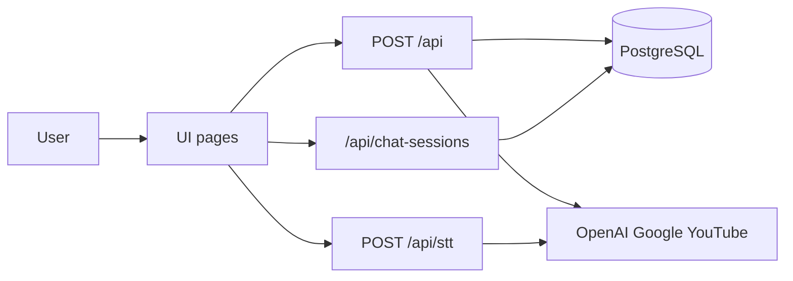

# Loco Architecture Routes + whatItProves

> **Last Updated:** July 30, 2026

> **In plain terms:** This is a route-by-route map of Loco’s UI and API surface, plus short “what it proves” claims for each piece. For the full system story, see [SYSTEM_ARCHITECTURE.md](./SYSTEM_ARCHITECTURE.md). For the full changelog, see [UPDATE.md](./UPDATE.md).

---

## 1. System whatItProves

- One interactive product surface (chat workspace) is orchestrated by a single main API entrypoint (`POST /api`).
- Persistence is Prisma + PostgreSQL and degrades gracefully when the database is unavailable.
- Chat answers can go through generate → review → optional revise before return.
- The same Next.js app runs in the browser or inside an Electron overlay shell.
- Docker Compose can bring up app + database with health checks in a deterministic from-scratch cycle (`GET /api/docker` documents that test).
- `assistantMode` from settings is resolved server-side (`lib/assistant/routing.ts`) and returned as `routing`.
- Chat / TTS / STT providers are shared under `lib/providers`.
- Calendar and YouTube connections are scoped to a user (`userId`), defaulting to the local app user.
- Workforce domain access goes through `lib/workforce`, not the chat route.
- Prompts are versioned under `/prompts` (with optional DB `Prompt` rows); schema snapshots live in `schemas/ai`.
- AI requests assemble stateless context (prompt + schema + rules + tool snapshots) and log to `AiInteractionLog`.

---

## 2. UI routes

### `GET /` — `app/page.tsx`

**Purpose:** Primary voice/text chat workspace: messages, speech, workspace preview (Preview / Code / Commands), session sidebar, optional Cesium / media panels.

**Key deps:** `tools/hooks/utils/apiClient.ts`, speech/audio hooks, message parser, chat-session and STT clients.

**whatItProves:**

- Text and voice can drive the same chat orchestrator.
- Assistant replies can be split into chat text, code, commands, and previewable artifacts.
- Sessions can be listed/saved/restored against the session APIs without leaving the main surface.

### `GET /settings` — `app/settings/page.tsx`

**Purpose:** Integrations and runtime preferences (voice themes, TTS provider, assistant mode UI, Google Calendar / YouTube connection controls, experimental toggles).

**Key deps:** Calendar and YouTube status APIs, local storage for playlist aliases, Electron detection.

**whatItProves:**

- Integration connect/disconnect is operable from a dedicated settings surface.
- Runtime preferences (voice / TTS / experimental flags) are user-configurable without code changes.
- Assistant-mode options exist in the UI; confirmed server consumption of every mode should still be verified against `app/api/route.ts` (see SYSTEM_ARCHITECTURE §5.5).

### `GET /experimental` — `app/experimental/page.tsx`

**Purpose:** Hub linking to experimental game demos.

**whatItProves:**

- Non-chat product experiments can live under a separate route tree without changing the main orchestrator.

### `GET /experimental/chess` — `app/experimental/chess/page.tsx`

**Purpose:** In-app chess demo.

**whatItProves:**

- The App Router can host self-contained interactive experiences beside the assistant.

### `GET /experimental/game` — `app/experimental/game/page.tsx`

**Purpose:** Ping pong / AI paddle demo.

**whatItProves:**

- Same experimental pattern as chess: isolated UI under `/experimental/*`.

---

## 3. API routes

### `POST /api` — `app/api/route.ts`

**Role:** Main chat orchestrator (controller + workflow). Validates the request, short-circuits specialized intents, builds memory/attachment context, generates, reviews, optionally revises, optionally synthesizes TTS, returns the payload.

**Orchestration notes (before normal generation):**

- Assistant memory recall / write
- Calendar draft confirm / cancel and live calendar read / delete
- Attachment-aware prompting
- Preview-error-aware correction
- Direct media / tool-like paths (e.g. YouTube / planet tour style intents when matched)

**whatItProves:**

- Loco is not a single raw LLM call; it is a rule-guided orchestration layer.
- Persistent chat memory and assistant facts can influence the prompt.
- Multi-pass QA (generate / review / revise) can run inside one request.
- Calendar and other tool-like workflows can complete without falling through to generic chat when intents match.
- `assistantMode` (`auto` / `loco` / `claude`) is honored server-side and returned as `routing`.
- Feature helpers live under `lib/orchestration` and providers under `lib/providers`.

### `GET` / `POST` / `DELETE` `/api/chat-sessions` — `app/api/chat-sessions/route.ts`

**Role:** List saved sessions (`GET`), save/upsert a session (`POST`), clear all sessions (`DELETE`).

**whatItProves:**

- Conversation persistence is separated from the main chat route.
- List/save/clear survive as dedicated CRUD-style endpoints.
- On recoverable DB outages, list returns empty with `persistenceUnavailable`; mutating calls return 503 instead of crashing the app.

### `DELETE /api/chat-sessions/[id]` — `app/api/chat-sessions/[id]/route.ts`

**Role:** Delete one saved conversation session by id.

**whatItProves:**

- Individual session deletion is supported without clearing the whole store.

### `POST /api/stt` — `app/api/stt/route.ts`

**Role:** Transcribe uploaded audio to text (Electron / recorded-audio path). Tries configured OpenAI STT models first, then optional Gemini fallback.

**whatItProves:**

- Voice input can use server transcription when browser Web Speech is not the runtime path.
- Provider fallback for STT is implemented at the API boundary.

### `GET` / `DELETE` `/api/google-calendar` — `app/api/google-calendar/route.ts`

**Role:** Connection status (`GET`: configured / connected / email); disconnect (`DELETE`).

**whatItProves:**

- Calendar OAuth state is queryable and clearable without going through the chat orchestrator.

### `GET /api/google-calendar/connect` — `app/api/google-calendar/connect/route.ts`

**Role:** Start Google OAuth for Calendar.

**whatItProves:**

- Connect flow is a dedicated redirect entrypoint.

### `GET /api/google-calendar/callback` — `app/api/google-calendar/callback/route.ts`

**Role:** OAuth callback; persists connection tokens.

**whatItProves:**

- Calendar credentials can be stored after a standard OAuth round-trip.

### `GET` / `DELETE` `/api/youtube` — `app/api/youtube/route.ts`

**Role:** Without `mode`, returns API/OAuth/connection status. With `mode=video|playlist`, search/playback helpers. `DELETE` disconnects YouTube OAuth.

**whatItProves:**

- YouTube status and media lookup share one route with explicit query modes.
- Ranking/filtering logic can prefer official / title-matched results over noisy first hits (see updates below).
- Disconnect is available independently of chat.

### `GET /api/youtube/connect` — `app/api/youtube/connect/route.ts`

**Role:** Start YouTube OAuth.

**whatItProves:**

- YouTube connect mirrors the Calendar connect pattern.

### `GET /api/youtube/callback` — `app/api/youtube/callback/route.ts`

**Role:** YouTube OAuth callback; persists connection.

**whatItProves:**

- YouTube OAuth round-trip can store connection state in Prisma.

### `GET` / `POST` `/api/youtube-memory` — `app/api/youtube-memory/route.ts`

**Role:** List remembered playbacks (`GET`); remember a playback (`POST`).

**whatItProves:**

- Played YouTube items can persist separately from live chat messages.
- Persistence outages degrade to empty list / 503 rather than hard failure.

### `POST /api/claude-code` — `app/api/claude-code/route.ts`

**Role:** Direct Anthropic Claude code-specialist endpoint (prompt + optional context / language / previous code). Requires `CLAUDE_API_KEY`.

**whatItProves:**

- A dedicated Claude code path exists outside the main `/api` orchestrator.
- Missing Claude configuration fails closed with a clear error response.

### `GET /api/docker` — `app/api/docker/route.ts`

**Role:** Returns a JSON “Docker Complete Guide” (compose concepts, health checks, troubleshooting, determinism test).

**whatItProves (determinismTest):**

- Setup is deterministic (works every time)
- Services start in correct order
- Health checks work properly
- Data persistence works
- New team members can clone and run

---

## 4. Schema-only (no app routes yet)

Workforce / rubric models in `prisma/schema.prisma` (`WorkforceMember`, `WorkforceArea`, `WorkforceCompetency`, `WorkforceRubricLevel`, `WorkforceAssessment`, `WorkforceEvidenceLink`) live in the same database as chat and integrations.

**whatItProves today:**

- A second product domain can share the DB schema without having an `app/api/workforce` surface yet.
- Absence of routes is intentional architectural separation, not implied by UI.

---

## 5. Updates mapped to routes / features

Curated from [UPDATE.md](./UPDATE.md). Not a full changelog.

| When | Area | Route / surface | What changed |
|------|------|-----------------|--------------|
| Mar 20, 2026 | Build / deps | App startup (docs) | Documented `undici` module resolution failure and install-in-app recovery |
| Mar 15, 2026 | YouTube matching | `/api/youtube`, chat YouTube fast-path | Typo normalization, movie/trailer media hints, ranking penalties for noisy video types |
| Mar 15, 2026 | YouTube workflow | `/api`, `lib/youtube.ts`, AI_WORKFLOW | Broader natural-language play intents; deterministic filters; clear error for personal library until OAuth covers it |
| Mar 15, 2026 | Coding standards | Docs / instructions | `LOCO_CODING_KNOWLEDGE_BASE.md` + coding-standards instructions for generation/review baseline |
| Mar 15, 2026 | Build | `tsconfig` / `app/api/route.ts` | Excluded `.next/dev/types` from typecheck; clarified false “route is not a module” failure |
| Mar 9, 2026 | Calendar + preview | `/api` calendar intents, `/` workspace | Live day-based calendar read/delete-with-confirm; preview tabs, fullscreen, JSX detection |
| Mar 9, 2026 | Workspace preview | `/` | Preview / Code / Commands panel, copy actions, HTML/CSS/JS/SVG/JSX sandbox |
| Mar 4 / Mar 2, 2026 | Chat UX | `/` | Markdown rendering, TTS URL filtering, pause/resume, undo, code copy, speech polish |

---

## 6. Related docs

- [SYSTEM_ARCHITECTURE.md](./SYSTEM_ARCHITECTURE.md) — orchestration, DB, models, infrastructure
- [FRAMEWORK.md](./FRAMEWORK.md) — product summary and feature status
- [AI_WORKFLOW.md](./AI_WORKFLOW.md) — how requests should be classified and reviewed
- [DOCKER.md](./DOCKER.md) — Docker setup narrative (JSON twin at `GET /api/docker`)
- [UPDATE.md](./UPDATE.md) — full update log
